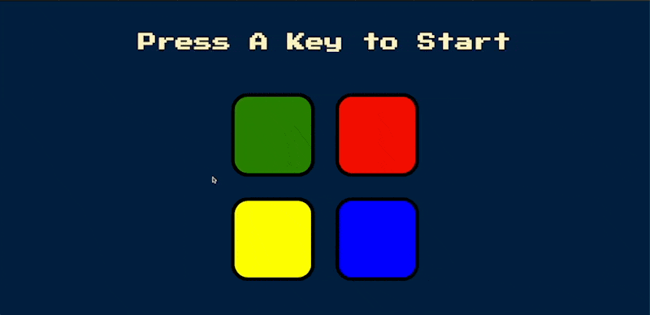
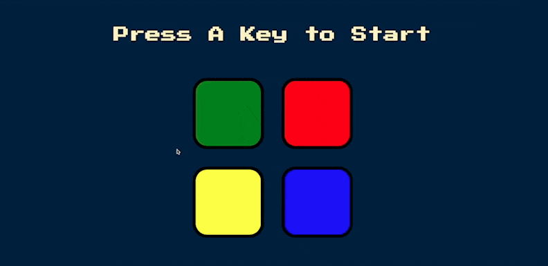
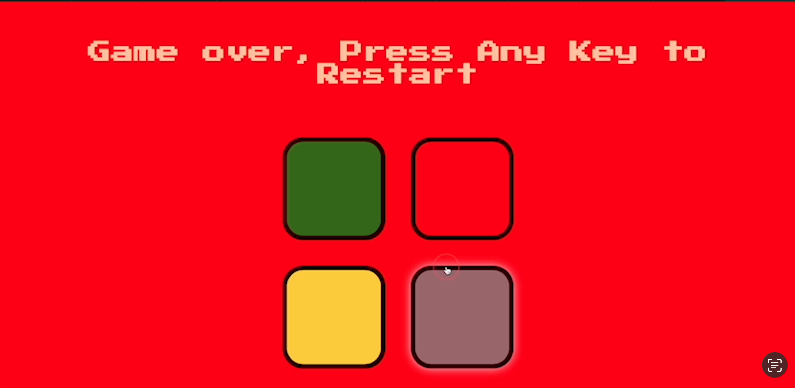

# Simon Says Game On Web Browser
Summary: Uses JavaScript for game logic which can go to any level you can memorize up to!
At the start press any button on your keyboard to initiate the game, memorize
the pattern and keep going until you forget a pattern! Fun sounds and colors will light up as you progress, once
you hear the game over sound you may restart the game  at any time you'd like.

## What It shows
This fun little game project shows I understand programming and game logic,
styling is consistent and well versed in JavaScript.

## How to Run The Game
* Clone this repo to your local machine or download the directory onto your desktop.
* Drag the "index.html" to your favorite browser
  * Alternatively right click on "index.html" and click "Open in", followed by your browser
* Click any key on your keyboard to start the game
* Wait for the first button to light up, click that button
* More buttons will light up as you progress each level! 
* Good Luck!

## Simon Says Demo
If you do not want to install the directory, below I have a .gif running the game as well as
the starting and ending screen.

### Demo Gif

### Simon Game Starting Screen

### Simon Ending Screen
